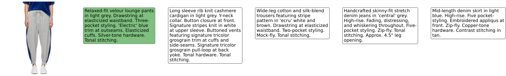

This repository contains the code to reproduce the results reported in the paper for Image-to-Text and Text-to-Image retrieval. A web application is available here: http://137.204.107.42:37336/ to test text-to-image retrieval.

You can run the code in two ways:
1. Creating a pip environment and running the python scripts from the shell, as described in the [Python Scripts](#Python-Scripts) section
2. Using the provided notebooks, which are self-contained and can be downloaded and easily executed in Google Colab (or locally with Jupyter)

# Python Scripts
## Clone the repository and create python environment
```bash
git clone https://github.com/ganainm-ai/Fashion_Retrieval.git
cd Fashion_Retrieval
python -m venv venv
source venv/bin/activate
pip install -r requirements.txt
```

## Download dataset
We release the validation dataset with captions and image embeddings extracted with our model. 
```bash
python ./dataset/download_dataset.py
tar -xvf ./dataset/validation_dataset_w_embeddings.tar.gz -C ./dataset/
```

## Evaluate
```bash
python -m scripts.evaluate
```
You should get the following results
| Task            | Rank@1 | Rank@5 | Rank@10 |
| ----------------| -------| -------| --------|
| Text to Image   | 66.90% | 96.10% | 98.80%  |
| Image to Text   | 61.50% | 94.00% | 97.80%  |

## T-sne visualization
```bash
python -m scripts.tsne_visualization --perplexity 65 --early_exaggeration 12.0 --n_iter 2000 --learning_rate 200 --random_state 42
```
The script should generate an svg image as this one:


# Notebooks
The notebooks can be downloaded and executed both in Google Colab or locally with Jupyter. If you open the notebooks locally, make sure to use a kernel with the libraries specified in the requirements.txt file.

## Evaluation
With the [Evaluation](./notebooks/Evaluation.ipynb) notebook you can obtain the evaluation results for Image-to-Text and Text-to-Image Retirieval. The notebook can also be used to visualize some sample queries such as:


and 




## T-sne Visualization
Open the [T-sne](./notebooks/Tsne-visualization.ipynb) notebook to produce a 2D visualization of the image embeddings using t-sne algorithm.
